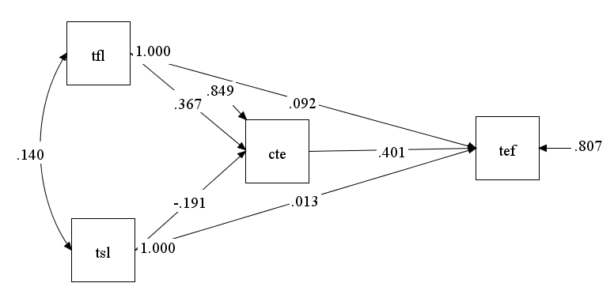

```{r setup, include=FALSE}
knitr::opts_chunk$set(message=FALSE,warning=FALSE, cache=TRUE)
```

```{r klippy, echo=FALSE, include=TRUE}
klippy::klippy(position = c('top', 'right'))
```


Last compiled: `r Sys.Date()`


# Path analysis

Reading assignment : Kurt, T., Duyar, I., & Calik, T. (2012). Are we legitimate yet? A closer look at the casual relationship mechanisms among principal leadership, teacher self‐efficacy and collective efficacy. Journal of Management Development, 31, 71-86. 

- Data in .txt format [Download](https://github.com/trsamp/SEM101/blob/main/data/01PA.txt)
- Data in SPSS format [Download](https://github.com/trsamp/SEM101/blob/main/data/01PA.sav)

```

TITLE: individual montecarlo
DATA:
  FILE IS data2.txt; !keep all file in the same folder

VARIABLE:
  NAMES ARE TFL TSL CTE TEF; !all variable in "data2.txt"
  USEVARIABLES ARE TFL TSL CTE TEF; 

MODEL: !put the syntax indicate causal relationships
	TEF ON CTE TSL TFL; ! TEF is regressed on CTE TSL TEL;
	CTE ON TSL TFL;
   TSL with TFL;

MODEL INDIRECT:
TEF IND TFL;

OUTPUT: SAMPSTAT STDYX; !standardized coefficient need to be report

```
## PRINTOUT

```
INPUT READING TERMINATED NORMALLY


individual montecarlo

SUMMARY OF ANALYSIS

Number of groups                                                 1
Number of observations                                         810

Number of dependent variables                                    2
Number of independent variables                                  2
Number of continuous latent variables                            0

Observed dependent variables

  Continuous
   CTE         TEF

Observed independent variables
   TFL         TSL


Estimator                                                       ML
Information matrix                                        OBSERVED
Maximum number of iterations                                  1000
Convergence criterion                                    0.500D-04
Maximum number of steepest descent iterations                   20

Input data file(s)
  data2.txt

Input data format  FREE


SAMPLE STATISTICS


     SAMPLE STATISTICS


           Means
              CTE           TEF           TFL           TSL
              ________      ________      ________      ________
                4.310         6.920         2.660         1.890


           Covariances
              CTE           TEF           TFL           TSL
              ________      ________      ________      ________
 CTE            0.422
 TEF            0.276         0.979
 TFL            0.181         0.186         0.672
 TSL           -0.050        -0.016         0.063         0.302


           Correlations
              CTE           TEF           TFL           TSL
              ________      ________      ________      ________
 CTE            1.000
 TEF            0.430         1.000
 TFL            0.340         0.230         1.000
 TSL           -0.140        -0.030         0.140         1.000


UNIVARIATE SAMPLE STATISTICS


     UNIVARIATE HIGHER-ORDER MOMENT DESCRIPTIVE STATISTICS

         Variable/         Mean/     Skewness/   Minimum/ % with                Percentiles
        Sample Size      Variance    Kurtosis    Maximum  Min/Max      20%/60%    40%/80%    Median

     CTE                   4.310       0.063       2.215    0.12%       3.781      4.160      4.304
             810.000       0.422      -0.029       6.519    0.12%       4.450      4.831
     TEF                   6.920      -0.117       4.006    0.12%       6.077      6.727      6.946
             810.000       0.979      -0.091       9.771    0.12%       7.192      7.741
     TFL                   2.660       0.075      -0.084    0.12%       1.974      2.399      2.661
             810.000       0.672      -0.009       5.094    0.12%       2.882      3.353
     TSL                   1.890       0.091       0.062    0.12%       1.405      1.749      1.887
             810.000       0.302      -0.089       3.571    0.12%       2.015      2.341


THE MODEL ESTIMATION TERMINATED NORMALLY


MODEL FIT INFORMATION

Number of Free Parameters                       14

Loglikelihood

          H0 Value                       -3431.893
          H1 Value                       -3431.893

Information Criteria

          Akaike (AIC)                    6891.787
          Bayesian (BIC)                  6957.545
          Sample-Size Adjusted BIC        6913.087
            (n* = (n + 2) / 24)

Chi-Square Test of Model Fit

          Value                              0.000
          Degrees of Freedom                     0
          P-Value                           0.0000

RMSEA (Root Mean Square Error Of Approximation)

          Estimate                           0.000
          90 Percent C.I.                    0.000  0.000
          Probability RMSEA <= .05           0.000

CFI/TLI

          CFI                                1.000
          TLI                                1.000

Chi-Square Test of Model Fit for the Baseline Model

          Value                            306.763
          Degrees of Freedom                     5
          P-Value                           0.0000

SRMR (Standardized Root Mean Square Residual)

          Value                              0.000


MODEL RESULTS

                                                    Two-Tailed
                    Estimate       S.E.  Est./S.E.    P-Value

 TEF      ON
    CTE                0.610      0.052     11.690      0.000
    TSL                0.024      0.059      0.406      0.685
    TFL                0.111      0.041      2.683      0.007

 CTE      ON
    TSL               -0.226      0.039     -5.854      0.000
    TFL                0.291      0.026     11.221      0.000

 TSL      WITH
    TFL                0.063      0.016      3.946      0.000

 Means
    TFL                2.660      0.029     92.380      0.000
    TSL                1.890      0.019     97.861      0.000

 Intercepts
    CTE                3.964      0.095     41.522      0.000
    TEF                3.950      0.251     15.749      0.000

 Variances
    TFL                0.672      0.033     20.125      0.000
    TSL                0.302      0.015     20.125      0.000

 Residual Variances
    CTE                0.358      0.018     20.125      0.000
    TEF                0.790      0.039     20.125      0.000


STANDARDIZED MODEL RESULTS


STDYX Standardization

                                                    Two-Tailed
                    Estimate       S.E.  Est./S.E.    P-Value

 TEF      ON
    CTE                0.401      0.032     12.568      0.000
    TSL                0.013      0.033      0.406      0.685
    TFL                0.092      0.034      2.691      0.007

 CTE      ON
    TSL               -0.191      0.032     -5.945      0.000
    TFL                0.367      0.031     12.005      0.000

 TSL      WITH
    TFL                0.140      0.034      4.064      0.000

 Means
    TFL                3.246      0.088     36.899      0.000
    TSL                3.438      0.092     37.224      0.000

 Intercepts
    CTE                6.102      0.227     26.918      0.000
    TEF                3.993      0.313     12.755      0.000

 Variances
    TFL                1.000      0.000    999.000    999.000
    TSL                1.000      0.000    999.000    999.000

 Residual Variances
    CTE                0.849      0.023     36.561      0.000
    TEF                0.807      0.025     32.391      0.000


R-SQUARE

    Observed                                        Two-Tailed
    Variable        Estimate       S.E.  Est./S.E.    P-Value

    CTE                0.151      0.023      6.528      0.000
    TEF                0.193      0.025      7.747      0.000

QUALITY OF NUMERICAL RESULTS

     Condition Number for the Information Matrix              0.152E-02
       (ratio of smallest to largest eigenvalue)


TOTAL, TOTAL INDIRECT, SPECIFIC INDIRECT, AND DIRECT EFFECTS


                                                    Two-Tailed
                    Estimate       S.E.  Est./S.E.    P-Value

Effects from TFL to TEF

  Total                0.288      0.042      6.932      0.000
  Total indirect       0.177      0.022      8.095      0.000

  Specific indirect

    TEF
    CTE
    TFL                0.177      0.022      8.095      0.000

  Direct
    TEF
    TFL                0.111      0.041      2.683      0.007


STANDARDIZED TOTAL, TOTAL INDIRECT, SPECIFIC INDIRECT, AND DIRECT EFFECTS


STDYX Standardization

                                                    Two-Tailed
                    Estimate       S.E.  Est./S.E.    P-Value

Effects from TFL to TEF

  Total                0.239      0.033      7.133      0.000
  Total indirect       0.147      0.017      8.485      0.000

  Specific indirect

    TEF
    CTE
    TFL                0.147      0.017      8.485      0.000

  Direct
    TEF
    TFL                0.092      0.034      2.691      0.007
```

## DIAGRAM from Mplus
<a href = "https://crumplab.github.io">
