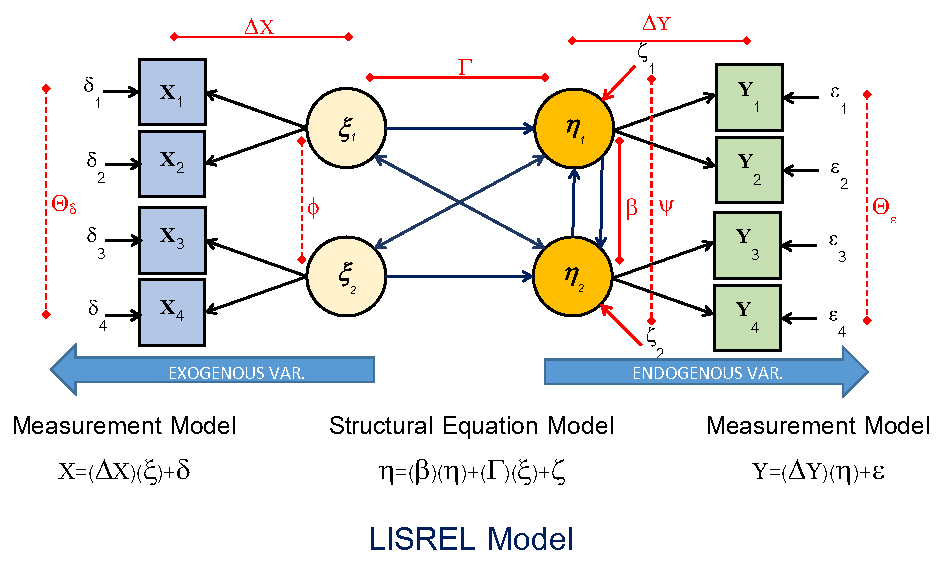

# **Instructions**

This is a template example for lab journaling. Students will use this template to learn R, and other things. Students can replace this text with more fun things. People not in my lab can use this too.

## How to use

....TBC

